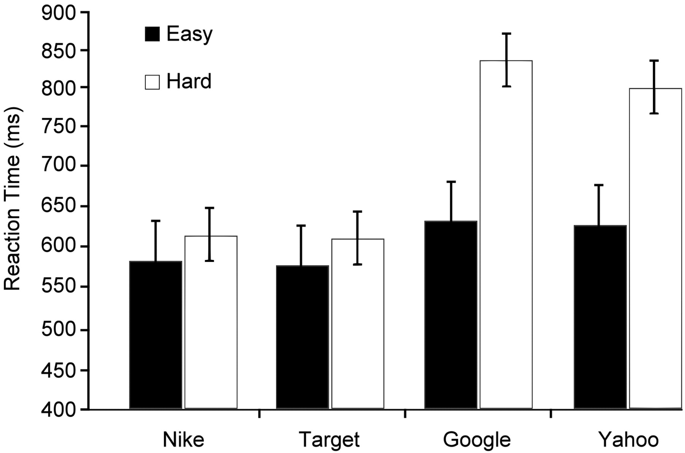

## Can you answer these questions?
- What are the colors on French flag?
- What are the colors on Belgiens flag?

## When you cannot answer...
- What is the first idea show up in your mind?

## Outline
1. Preview the original study
2. Post-review the critical results
3. Actions in this project

## Why this study?
- Public issue (google "Google Effect")
- Expand the scope of cognitive psychology
- Check [the original article](https://www.sciencemag.org/content/333/6043/776.full)

## Hypothesis
- "Once information has been accessed, our internal encoding is increased for where the information is to be found rather than for the information itself."
- Exp 1: If we are asked a hardly answered question, do we immediately think to go online to find out? 
- Exp 2: Do we remember information we expect to have later access to — as we could search online?
- Exp 3: Do we remember where to find information that is available online?
- Exp 4: Do we remember where to find than what is the information?

## Design: Methods in every experiement
- Exp 1: Modification Stroop Task-- after answered easy/hard questions
- Exp 2: Recall task-- Saved/Erased studied notes; cue/no cue to remeber the typings
- Exp 3: Recognition task-- Saved/Categorized/Erased studied notes
- Exp 4: Recall task-- Firstly recall the studied notes; secondly recall the folders saved the notes.

## Findings
1. Computer terms had a Stroop effect between easy and hard questions
2. Erased notes(30%) had a higher accuracy than saved notes(20%)
3. Erased notes (93%) > Saved(88%) = Categorized(85%)
4. Where to saved (49%) had a higher recall accuracy than what to saved(23%)

## Public issue and debate
- External factor is aid or balk to human memory?
- Is the knowledge representation matter?
- Have we to rethink how human memory operate?

## Our Goal
Will we replicate the results of experiment 1?  


## Why we reproduce the experiment 1?
- Understand within-participant design  
- Learn how to evaluate the sample size  
- How to make exact replication

## Within participant design  
- Randomly assign the Questions and critical words
- Take a look at "GoogleEffect_V1"  

## Design of original study
- Stimulus: Question lists; Critical words; 
- Modified Stroop Task (we will experience later)

## Preparation: Stimulus
- Structure of questions and critical words
- Translation
- Match cultural situation

## Preparation: Program and Measurement
- Procedure of the modified Stroop task
- codebook of the raw data
- Test "GoogleEffect_V1"

## Preparation: Estimate sample Size
1. Estimate the effect size
2. Compute the power by effect size
3. Decide the sample size by the effect size

## Estimate the effect size
*esComp()* in [furncions.r](functions.r)  
We have this function from [RP:P project]
```
esComp <- function(
  x,
  df1,
  df2,
  N,
  esType){
  esComp <- ifelse(esType=="t",           # For t test
                   sqrt((x^2*(1 / df2)) / (((x^2*1) / df2) + 1)),
                   ifelse(
                     esType=="F",         # For F test
                     sqrt((x*(df1 / df2)) / (((x*df1) / df2) + 1))*sqrt(1/df1),
                     ifelse(
                       esType=="r",       # For correlation
                       x,
                       ifelse(
                         esType=="Chi2",  # For chi square
                         sqrt(x/N),
                         ifelse(
                           esType == "z", # For z test
                           tanh(x * sqrt(1/(N-3))), 
                           NA
                         )
                       )
                     )
                   ))
  return(esComp)
}
```

## Estimate the effect size
1. Computer terms vs. General terms: t(68) = 3.26, N = 69
2. Computer terms after easy vs. after hard: t(68) = 2.98, N = 69
```{r effectsize, cache=TRUE, echo = FALSE, warning=FALSE, message=FALSE}
source("functions.r")
# Exp 1
# Computer terms vs. General terms: t(68) = 3.26, N = 69
d.terms1 <- esComp(3.26, 68, 68, 69, "t")
d.terms1
# Computer terms after easy vs. after hard: t(68) = 2.98, N = 69
d.terms2 <- esComp(2.98, 68, 68, 69, "t")
d.terms2
```

## Compute the power by effect size
1. Computer terms vs. General terms
2. Computer terms after easy vs. after hard
3. What is the major effect?
```{r pwr1, cache=TRUE, echo = FALSE, warning=FALSE, message=FALSE}
require(pwr)
power.terms1 <- pwr.t.test(d=d.terms1, n=69, sig.level=0.05, type = "paired",alternative="two.sided")
power.terms1$power
power.terms2 <- pwr.t.test(d=d.terms2, n=69, sig.level=0.05, type = "paired",alternative="two.sided")
power.terms2$power
```

## Evluate the effect size by sample size
How large is the major effect?
```{r powerplot, cache=TRUE, echo = FALSE, warning=FALSE, message=FALSE}
n <- seq(40, 150, by = 10) # Expected number of participants in replication study
power <- pwr.t.test(d=d.terms2, n=n, sig.level=0.05, type = "paired",alternative="two.sided")$power
plot(n, power)
```

## Preparation: IRB
- Could these treatments violate research ethic?
- Without harm for the participants after the study
- Considerations for IRB

## Actions in this project
- Nearly exact replication of Experiment 1
- Except the languages, all the details in the method are as the same as the original study.
- Considering the power, how to decide the acceptable sample size?
- Modified Stroop Task came from [Emotional Stroop Test](https://en.wikipedia.org/wiki/Emotional_Stroop_test)

## Will we have a exact replication?
- Lower the difference of languages and cultures
- Categories of questions
- Equivalent terms

## How to Write Proposal
- **Introduction: Autopsy of the original study**
  1. Hypothesis of Experiment 1
  2. Design: Independent variable and Dependant variable
  3. Prediction
- **Method**
  1. Sample: how many participant?
  2. Treatments: Questions(Easy, Hard), Critical Terms(Computer, General) <- How to translate/modify?
  3. Measurement: Reaction times
  4. Proceduree: Modified Stroop Task
  5. Analysis: coodbook <- check the csv file (after complete GoogleEffectV1)
